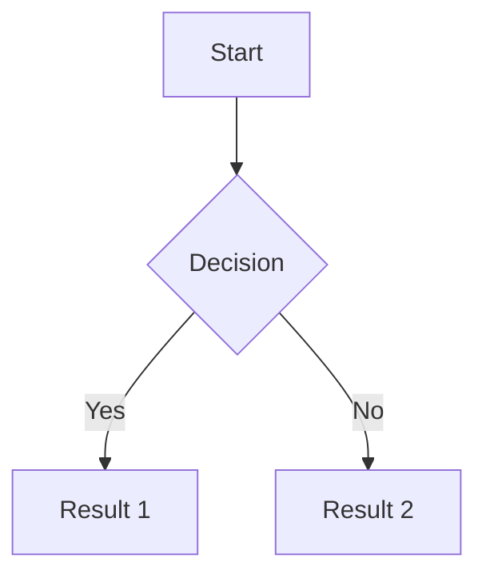

<!-- Use this file to provide workspace-specific custom instructions to Copilot. For more details, visit https://code.visualstudio.com/docs/copilot/copilot-customization#_use-a-githubcopilotinstructionsmd-file -->

# MkDocs Project

This is a MkDocs project using the Material theme with support for Mermaid diagrams, Draw.io diagrams, and Confluence publishing.

## Project Structure

- `docs/`: Contains all markdown documentation files
- `mkdocs.yml`: Main configuration file
- `requirements.txt`: Dependencies
- `publish.py`: Script for publishing to Confluence

## Coding Guidelines

- Follow Markdown best practices for documentation files
- Use appropriate admonitions, tabs, and other Material theme features
- Ensure diagrams are properly formatted for their respective formats
- Keep configuration organized in the mkdocs.yml file

## Examples

### Adding a new page

```markdown
# Page Title

Content goes here.

## Section

More content.
```

### Adding a Mermaid diagram

```markdown

```

### Adding a Draw.io diagram

```markdown

```
