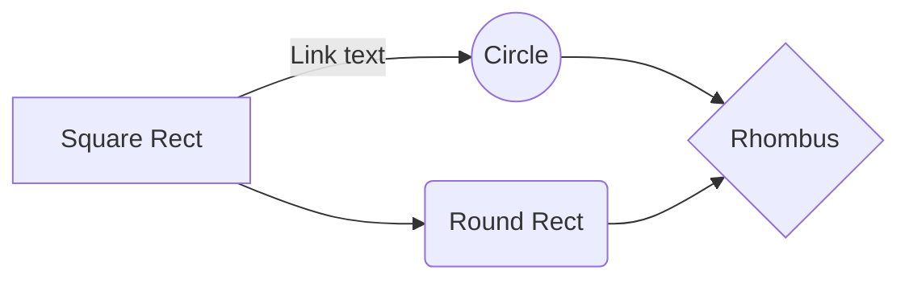
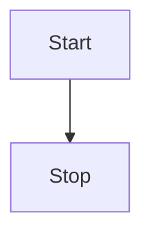
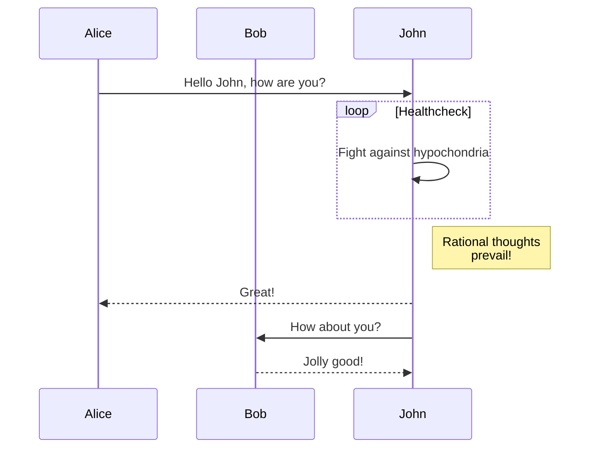
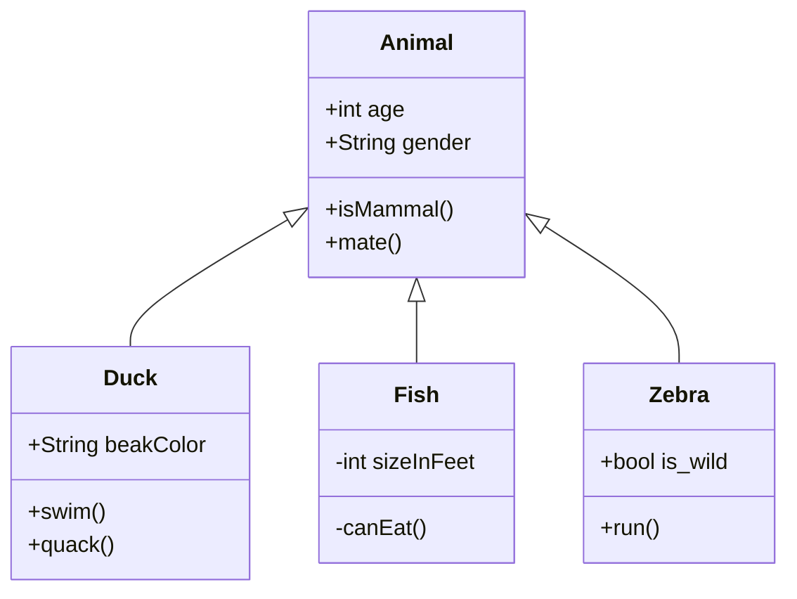
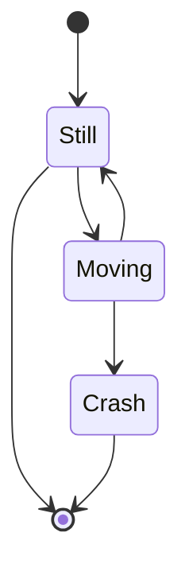
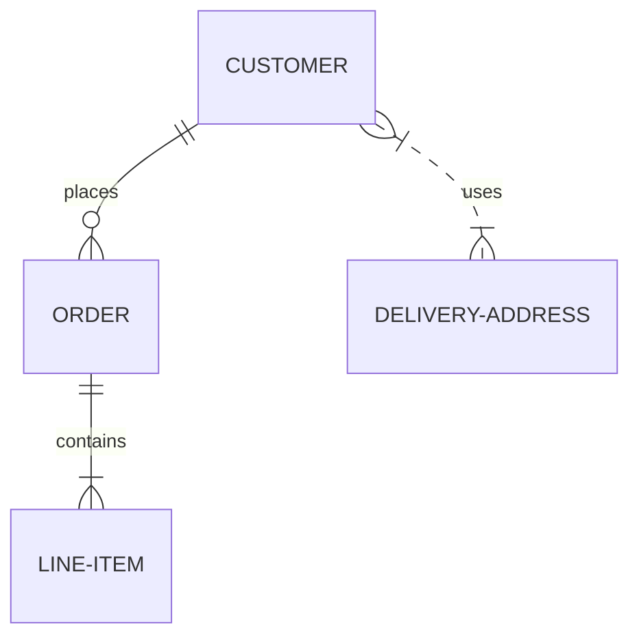
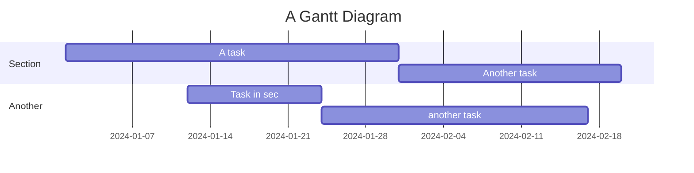
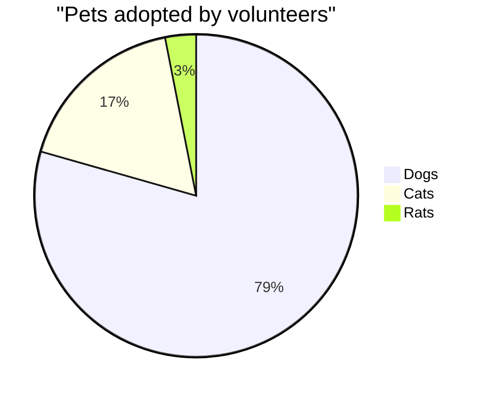

# Mermaid Diagrams

[Mermaid](https://mermaid-js.github.io/mermaid/#/) is a JavaScript-based diagramming and charting tool that renders Markdown-inspired text definitions to create and modify diagrams dynamically.

## Getting Started with Mermaid

To create a Mermaid diagram in your documentation, use the following syntax:

````markdown

````

This will render as:


## Diagram Types

### Flowchart



### Sequence Diagram



### Class Diagram



### State Diagram



### Entity Relationship Diagram



### Gantt Chart



### Pie Chart



## Theme Customization

You can customize the appearance of your Mermaid diagrams by adding a custom theme in your configuration.

## Tips for Creating Effective Diagrams

1. **Keep it simple**: Focus on clarity over complexity
2. **Use consistent styling**: Maintain consistent colors and shapes for similar elements
3. **Add helpful labels**: Clear labels help viewers understand the diagram
4. **Consider direction**: Use LR (left to right) for wide diagrams and TD (top down) for tall ones
5. **Break up complex diagrams**: Split complex processes into multiple smaller diagrams

## Troubleshooting

If your diagram doesn't render correctly:

1. Check for syntax errors
2. Verify that the mermaid2 plugin is correctly installed and configured
3. Make sure you're using code blocks with the `mermaid` language specifier
4. Check the browser console for any JavaScript errors
