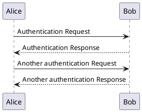
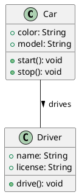
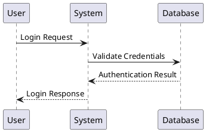
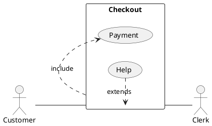
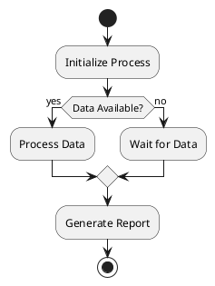
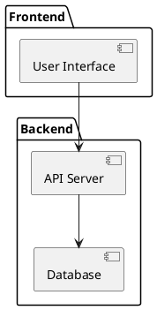
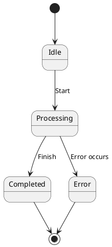
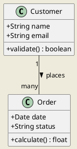

# UML Diagrams with PlantUML

PlantUML is a powerful tool that allows you to create UML diagrams using a simple text-based syntax. This page provides an overview of how to use PlantUML in your MkDocs documentation.

## Getting Started with PlantUML

PlantUML uses a simple and intuitive language for defining diagrams. You can create diagrams directly in your Markdown files using code blocks with the `plantuml` tag.

### Basic PlantUML Diagram



The diagram above will render as shown below when the site is built.

## UML Diagram Types

PlantUML supports all standard UML diagram types:

### Class Diagrams



### Sequence Diagrams

Sequence diagrams show object interactions arranged in time sequence:



### Use Case Diagrams



### Activity Diagrams



### Component Diagrams



### State Diagrams



## PlantUML Files (.puml)

You can also create PlantUML diagrams in separate files with the `.puml` extension.

### Example PlantUML Files

We have created several example PlantUML diagrams that demonstrate different capabilities:

#### System Architecture Diagram


#### Document Processing Workflow


#### Authentication Sequence Diagram


### Creating Your Own .puml Files

To create your own PlantUML diagram:

1. Create a new file with the `.puml` extension in your documentation's assets or diagrams folder
2. Start with the `@startuml` tag
3. Add your diagram content
4. End with the `@enduml` tag
5. Reference the diagram in your Markdown with standard image syntax

```markdown

```

## PlantUML Best Practices

1. **Keep it simple** - Focus on clarity over complexity
2. **Use descriptive labels** - Make sure all relationships and components are clearly labeled
3. **Add colors and styles** - Use colors and styles to enhance readability
4. **Break large diagrams** - Divide complex diagrams into smaller, focused ones
5. **Be consistent** - Maintain consistent styling across all diagrams
6. **Add notes** - Use notes to explain complex parts of your diagrams

## Advanced Styling

You can enhance your PlantUML diagrams with colors and styling:



## Integrating with MkDocs

With the PlantUML plugin configured in your `mkdocs.yml`, all PlantUML code blocks will be automatically rendered into SVG diagrams when your site is built.
