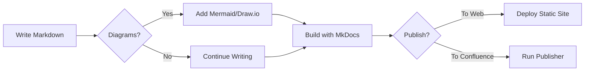

# Welcome to the Documentation Site

This documentation site is built with [MkDocs](https://www.mkdocs.org/) using the [Material for MkDocs](https://squidfunk.github.io/mkdocs-material/) theme. It provides a comprehensive framework for maintaining and publishing documentation.

## Features

- **Markdown Support**: Write all your documentation in plain Markdown
- **Material Design**: Beautiful responsive design with Material Design guidelines
- **Diagram Support**: Create professional diagrams directly in your markdown
  - [Mermaid](diagrams/mermaid.md) - Flow charts, sequence diagrams, etc.
  - [PlantUML](diagrams/plantuml.md) - UML diagrams and more
  - [Draw.io](diagrams/drawio.md) - Advanced diagramming with Draw.io
- **Confluence Publishing**: Seamlessly publish your docs to Confluence

## Getting Started

To get started with using this documentation, please visit the [Getting Started](user-guide/getting-started.md) page.

## Quick Start

Here's a simple example of a Mermaid flowchart diagram showing the documentation workflow:

This diagram illustrates the workflow from writing markdown content to publishing it either as a static site or to Confluence.
