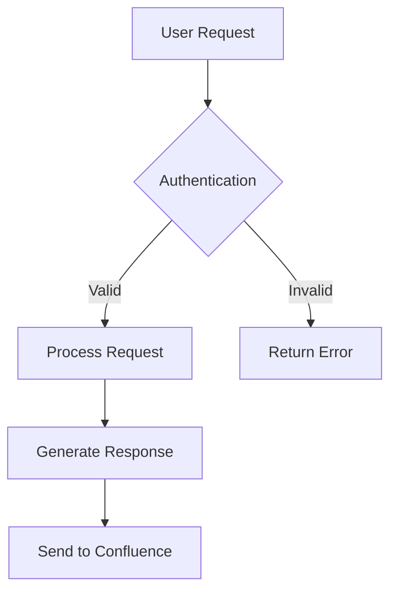

# Features

This documentation system provides a comprehensive set of features for creating, maintaining, and publishing professional documentation. Built on MkDocs with extensive customizations for corporate environments.

## 🎨 Material Design Theme

Powered by [Material for MkDocs](https://squidfunk.github.io/mkdocs-material/) with enhanced features:

- **📱 Responsive Design**: Perfect on desktop, tablet, and mobile devices
- **🌓 Dark/Light Mode**: Automatic switching based on user preferences
- **🔍 Advanced Search**: Built-in search with highlighting and suggestions
- **🧭 Navigation**: Tabs, sections, and breadcrumb navigation
- **🎯 Focus Mode**: Distraction-free reading experience
- **⚡ Performance**: Fast loading with minified assets

## 📝 Advanced Markdown Support

Enhanced Markdown with professional publishing capabilities:

### Admonitions & Callouts

Create professional highlighted sections:

```markdown
!!! note "Important Information"
    This creates a note callout with custom styling.

!!! warning "Security Alert"
    Critical security information stands out clearly.

!!! tip "Pro Tip"
    Helpful hints for better documentation.

!!! success "Confluence Ready"
    All admonitions convert properly to Confluence format.
```

**Renders as:**

!!! note "Important Information"
    This creates a note callout with custom styling.

!!! warning "Security Alert"
    Critical security information stands out clearly.

!!! tip "Pro Tip"
    Helpful hints for better documentation.

!!! success "Confluence Ready"
    All admonitions convert properly to Confluence format.

### Code Blocks with Advanced Features

Professional code presentation with copy buttons:

```python title="example.py" linenums="1"
def confluence_publisher():
    """Custom Confluence publisher with corporate support."""
    return {
        "ssl_bypass": True,
        "bearer_auth": True,
        "error_handling": "robust"
    }
```

```yaml title="mkdocs.yml"
plugins:
  - confluence_publisher:
      space_key: "DOCS"
      dry_run: false
      verify_ssl: false
```

### Tables with Sorting

| Feature | Status | Confluence Support |
|---------|--------|-------------------|
| Mermaid Diagrams | ✅ Working | 📋 Code Block |
| PlantUML | ✅ Working | 📋 Placeholder |
| Draw.io | ✅ Working | ⚠️ Limited |
| Code Blocks | ✅ Working | ✅ Converts |
| Tables | ✅ Working | ✅ Converts |

### Task Lists & Tabs

**Task Lists:**
- [x] MkDocs setup completed
- [x] Confluence publisher working
- [x] All plugins functional
- [ ] Advanced customizations

**Tabbed Content:**

=== "Development"
    ```bash
    mkdocs serve
    ```
    Start local development server with live reloading.

=== "Production"
    ```bash
    mkdocs build
    ```
    Build static site and publish to Confluence automatically.

=== "Configuration"
    ```yaml
    site_name: Your Documentation
    theme:
      name: material
    ```

## 📊 Comprehensive Diagram Support

Professional diagram creation with multiple formats:

### Mermaid Diagrams
Perfect for flowcharts, sequence diagrams, and system architecture:



### PlantUML Integration
UML diagrams with local or cloud rendering:

- **Sequence Diagrams**: User interactions and API flows
- **Class Diagrams**: System architecture and relationships
- **Activity Diagrams**: Process workflows
- **Component Diagrams**: System structure

### Draw.io Support
Complex diagrams with visual editor:

- **Architecture Diagrams**: System overviews
- **Network Diagrams**: Infrastructure layouts
- **Process Flows**: Business processes
- **Wireframes**: UI/UX designs

## 🚀 Confluence Publishing

**Production-ready Confluence integration** with corporate environment support:

### Key Features
- ✅ **SSL Bypass**: Works in corporate environments with certificate issues
- ✅ **Bearer Token Auth**: Secure authentication for modern Confluence
- ✅ **Page Hierarchy**: Maintains proper parent-child relationships
- ✅ **Format Conversion**: Markdown → Confluence storage format
- ✅ **Error Handling**: Robust error recovery and logging
- ✅ **Dry Run Mode**: Test publishing without making changes

### Publishing Process
1. **Build Documentation**: `mkdocs build`
2. **Auto-Publish**: Plugin automatically publishes during build
3. **Page Management**: Creates/updates pages with proper structure
4. **Content Conversion**: Preserves formatting and links

### Diagram Conversion in Confluence

Since Confluence doesn't natively support Mermaid or complex SVG diagrams, the publisher now handles them with enhanced conversion:

- **✅ Mermaid Diagrams**: Converted to PNG images with source code reference
  - Supports two rendering options:
    - [markdown-mermaid-cli](https://pypi.org/project/markdown-mermaid-cli/) (Python package, recommended)
    - [mermaid-cli](https://github.com/mermaid-js/mermaid-cli) (Node.js package, alternative)
  - Falls back to code display when neither is available
- **✅ PlantUML Diagrams**: Converted to PNG images from SVG with explanatory text
  - Requires CairoSVG library (already included in requirements)
  - Falls back to placeholder text when CairoSVG is unavailable
- **⚠️ Draw.io Diagrams**: May have rendering issues, works best with simple diagrams

Images are automatically attached to Confluence pages for optimal viewing experience. For the best interactive diagram experience, users can still refer to the web version of the documentation.

### Configuration Example
```yaml
plugins:
  - confluence_publisher:
      confluence_prefix: "MkDocs - "
      space_key: "DOCS"
      parent_page_id: 123456789
      dry_run: false
      verify_ssl: false
      upload_attachments: false
```

## 🔧 Corporate Environment Features

Designed specifically for enterprise use:

### Offline Package Management
- **Local Packages**: All dependencies included as wheel files
- **No Internet Required**: Fully functional without external access
- **Security Compliant**: No external downloads during installation

### Enterprise Authentication
- **Bearer Token Support**: Modern OAuth-style authentication
- **SSL Certificate Bypass**: Handle corporate proxy/firewall issues
- **Environment Variables**: Secure credential management via `.env` files

### Development Tools
- **VS Code Integration**: Pre-configured tasks for common operations
- **Hot Reloading**: Live preview during development
- **Build Automation**: Automated building and publishing pipeline

## 🎯 Performance & Optimization

Optimized for speed and efficiency:

### Build Optimization
- **Minification**: CSS, JS, and HTML compression
- **Caching**: Diagram rendering and asset caching
- **Parallel Processing**: Fast builds even with many pages

### Search Performance
- **Indexed Search**: Fast full-text search across all content
- **Search Boost**: Weighted search results for better relevance
- **Offline Search**: Works without server connection

## 📐 Mathematical Expressions

LaTeX-style math rendering for technical documentation:

**Inline math**: $E = mc^2$

**Block equations**:
$$
\frac{\partial f}{\partial x} = \lim_{h \to 0} \frac{f(x+h) - f(x)}{h}
$$

**Complex formulas**:
$$
\int_{-\infty}^{\infty} e^{-x^2} dx = \sqrt{\pi}
$$

## 🛠️ Available Plugins

Full plugin ecosystem for extended functionality:

| Plugin | Purpose | Status |
|--------|---------|--------|
| **confluence_publisher** | Confluence integration | ✅ Production Ready |
| **mermaid2** | Mermaid diagram rendering | ✅ Working |
| **plantuml** | PlantUML diagram support | ✅ Working |
| **drawio-exporter** | Draw.io diagram export | ✅ Working |
| **minify** | Asset optimization | ✅ Working |
| **search** | Enhanced search | ✅ Working |

## 🎨 Customization Options

Extensive customization capabilities:

### Theme Customization
- **Color Schemes**: Multiple palette options
- **Typography**: Custom fonts and sizing
- **Layout**: Flexible navigation and content layouts
- **Branding**: Logo, favicon, and company styling

### Content Features
- **Custom CSS**: Add your own styling
- **JavaScript Integration**: Custom functionality
- **Template Overrides**: Modify page templates
- **Icon Libraries**: Extensive icon support

## 🔍 Advanced Search Features

Professional search capabilities:

- **Fuzzy Search**: Find content even with typos
- **Weighted Results**: Important pages rank higher
- **Search Highlighting**: Visual search result emphasis
- **Keyboard Navigation**: Fast search without mouse
- **Search Suggestions**: Auto-complete for faster discovery

!!! success "Ready for Production"
    This documentation system is production-ready with enterprise-grade features for teams of any size. The Confluence integration ensures seamless knowledge sharing across your organization.
